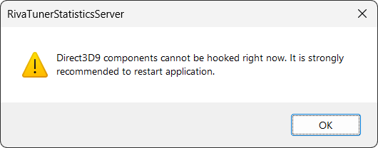

# Softwares notes

| Link                                                                                                 |
| :--------------------------------------------------------------------------------------------------: |
| [Edge/Chrome custom shortcut profile](#edgechrome-custom-shortcut-profile)                           |
| [Fixing popup unlicensed software Adobe Photoshop](#fixing-popup-unlicensed-software-adobe-photoshop)|
| [Fixing INK pressure in Photoshop](#fixing-ink-pressure-in-photoshop)                                |
| [Changing the UI accent color on Photoshop](#changing-the-ui-accent-color-on-photoshop)              |
| [Better response on Illustrator](#better-response-on-illustrator)                                    |
| [Hide ADS uTorrent](#hide-ads-utorrent)                                                              |
| [Improve download speed uTorrent](#improve-download-speed-utorrent)                                  |
| [Riot games doesn't launch](#riot-games-doesnt-launch)                                               |

---

## Edge/Chrome custom shortcut profile

1. Switch to the profile you want to create the shortcut
2. Open the url `edge://version/` or `chrome://version/`
3. Check the profile name in `Profile path:` at the end of the directory and make note of it
4. Create a shortcut of the browser and inside **properties** (alt + enter) add the following argunment:
   - > `--profile-directory="Default"`
   - > e.g. `"C:\Program Files (x86)\Microsoft\Edge\Application\msedge.exe" --profile-directory="Profile 1"`
5. You're all done

> by the way, those "arguments" are called _command line switches_. [Click here](https://peter.sh/experiments/chromium-command-line-switches/) to see more.

## Fixing popup unlicensed software Adobe Photoshop

Create an outbound rule that blocks all these IP addresses below:

```txt
18.207.85.246
23.22.254.206
34.193.227.236
52.5.13.197
52.202.204.11
54.144.73.197
54.227.187.23
107.22.247.231
108.157.78.78
108.157.78.79
108.157.78.98
108.157.78.125
```

_Alternatively, use Adobe GenP to make it automatically._

## Fixing INK pressure in Photoshop

1. Go to your ink settings and enable `Windows INK` option.

2. Navigate to `C:\Users\%userprofile$\AppData\Roaming\Adobe\Adobe Photoshop %version%\Adobe Photoshop %version% Settings\`.

3. Create a file named `PSUserConfig.txt`.

4. Now you must open the file you've created and type the following in the first line of the document: `UseSystemStylus 0`.

5. Save the document and open photoshop again.

## Changing the UI accent color on Photoshop

1. Navigate through the directory `C:\Program Files\Adobe\Adobe Photoshop 2023\Required`
2. Locate the file `UIColors.txt` and create a backup of this file `UIColors.bkp`
3. Open the file to change the parameters
4. Find the item you want to customize the color and change the RGB values manually

> Tip: there will be four rows in each item color. Each row corresponds to a predefined theme color into the interface tab inside photoshop preferences.

- Here are a few items that can be listed as the bests to make your interface have an accent color.

| Item                         | Description                                 |
| ---------------------------- | ------------------------------------------- |
| RulerText                    | Numbers on the Horizontal & Vertical Rulers |
| RulerMarkers                 | The lines on the Rulers                     |
| ScrollingListSelectedDefault | Selected layers in the Layers Panel         |
| WidgetButtonStroke           | Button outlines                             |
| WidgetButtonFillPressed      | Pressed buttons                             |
| WidgetPillStrokeFocused      | Buttons on hover outline                    |
| WidgetScrollbarArrows        | Scrollbar arrows                            |
| WidgetScrollbarElevatorFill  | Scrollbar Rectangle                         |

There is also another way to change this color using [this script](content/341-Ui-Color-Picker-by-jazz-y.zip).

It's really simple.

1. Download and extract the script
2. Open with Adobe Photoshop
3. Click "Yes" on the pop-up that will appear
4. Search for the item and change the color
5. Save the file `UIColors.txt` and override it inside the folder shown in the steps above
6. Restart Photoshop

## Better response on Illustrator

1. Press <kbd>ctrl</kbd>+<kbd>K</kbd> and go to the performance tab
2. Enable the option **_Real-time Drawing and Editing_**

## Hide ADS uTorrent

Just simply disable these options listed below:

- `gui.show_plus_upsell`
- `offers.sponsored_torrent_offer_enabled`
- `offers.left_rail_offer_enabled`

## Improve download speed uTorrent

1. Go into the tab **Bandwidth**
2. Set the option **Global maximum number of connections** to `400`

## Riot games doesn't launch

This issue can happen after cracking a software.

1. Lauch <kbd>Regedit</kbd>
2. Locate the directory `Computer\HKEY_LOCAL_MACHINE\SOFTWARE\Microsoft\Windows NT\CurrentVersion\Image File Execution Options`
3. Under the option `DevOverrideEnable` change the value <kbd>1</kbd> to <kbd>0</kbd>
4. Restart the computer and you can open the riot game that was not launching

---

## Solve issue with Discord overlay

There is an issue where MSI Afterburner don't let the discord overlay show up inside any game.

1. To solve this, navigate to `C:\Program Files (x86)\RivaTuner Statistics Server\ProfileTemplates`
2. Open the file `GLOBAL`
3. Add the following code under the line that contains `InjectionDelay=15000`

```js
InjectionDelayTriggers=IGO64.dll,IGO32.dll,d3dcompiler_47.dll,DiscordHook.dll,DiscordHook64.dll,GameOverlayRenderer.dll,GameOverlayRenderer64.dll,steam_api64.dll,steam_api.dll,d3d9.dll,dxgi.dll,d3d9_smaa.dll,d3d11.dll,DiscordOverlay.dll,DiscordOverlay64.dll
```

---

## RivaTuner Statistics Sever Direct3D9 Cannot be hooked



1. Go inside RivaTuner folder
2. under the directory `ProfileTemplates` open the file `CONFIG`
3. Open this file as Administrator using VSCode and then change the parameter <kbd>Silent</kbd> to `1`
4. Save the file and it should be done


## MSI AFTERBURNER CONFIG

| Colors Library | R   | G   | B   |
| -------------- | :-: | :-: | :-: |
| Color 0        | 185 | 231 | 0   |
| Color 1        | 224 | 0   | 49  |
| Color 2        | 17  | 175 | 242 |
| Color 3        | 255 | 255 | 255 |
| System Color   | 255 | 255 | 255 |

| Separatos  | Value                                          |
| ---------- | ---------------------------------------------- |
| Prolog     | `<C3><B=0,0>\b`                                |
| Text       | `\n`                                           |
| Group name | `\t`                                           |
| Group data | Separator that you want - In my case **space** |
| Epilog     | `\n<S=100><C4>%Time%     <S=200><FR>FPS`       |

| Group Separator | Value |
| --------------- | ----- |
| Framerate       | `\n`  |
| CPU usage       | `\n`  |

---

| Navigation                    |
| ----------------------------- |
| [🠝 go top](#softwares-notes) |
| [🠜 go back](./readme.md)     |
