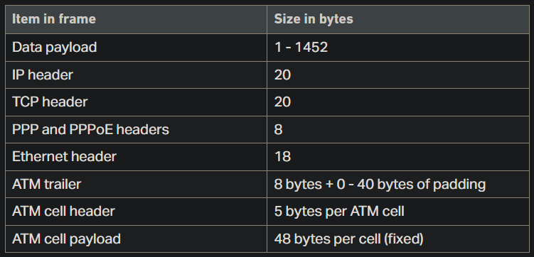

# Windows

| Link                                                                                                 |
| :--------------------------------------------------------------------------------------------------: |
| [Can't open Shared folder W11](#cant-open-shared-folder-w11)                                         |
| [Custom edge/chrome shortcut](#custom-edgechrome-shortcut)                                           |
| [Windows can't sync clock to the internet](#windows-cant-sync-clock-to-the-internet)                 |
| [Issues with apps when using router WIFI](#issues-with-apps-when-using-router-wifi)                  |
| [Windows shortcuts](#windows-shortcuts)                                                              |
| [Windows 10/11 Blurred apps fix](#windows-1011-blurred-apps-fix)                                     |
| [Autorun file](#autorun-file)                                                                        |
| [Windows Activation](#windows-activation)                                                            |
| [Get full ownership on windows](#get-full-ownership-on-windows)                                      |
| [Issue with hard disk windows in 100%](#issue-with-hard-disk-windows-in-100)                         |
| [Temporary folders](#temporary-folders)                                                              |
| [Shutdown windows](#shutdown-windows)                                                                |
| [Run the System File Checker tool (SFC.exe)](#run-the-system-file-checker-tool-sfcexe)               |
| [How to disable Windows Defender on Windows 10/11](#how-to-disable-windows-defender-on-windows-1011) |
| [Enabling Ultimate performance in power mode](#enabling-ultimate-performance-in-power-mode)          |
| [Missing open/close laptop lid in power options](#missing-openclose-laptop-lid-in-power-options)     |
| [How to Change Windows boot logo](#how-to-change-windows-boot-logo)                                  |
| [Restore old right-click context menu in W11](#restore-old-right-click-context-menu-in-w11)          |

---

## Can't open Shared folder W11

1. Open **Turn Windows Features On or Off**
2. Enable `SMB 1.0/CIFS Client` and `SMB 1.0/CIFS Server`
3. Open `gpedit.msc` or *Group policies editor*
4. Navigete through `Administrative templates > Network > Lanman Workstation`
5. Make the setting **enable insecure guests logons** <kbd>enabled</kbd>

### Other solutions

1. Inside `gpedit.msc` navigate through `Windows Settings > Security Settings > Local Policies > Security Options`
2. Locate the policy **Microsoft network server: Digitally sign communications (always)** and make sure it's <kbd>disabled</kbd>

## Custom edge/chrome shortcut

1. Open the profile that you want to set a shortcut
2. go to the link `edge://version/`
3. Locate **profile path**
4. make note of the profile number
5. Create a shortcut link from the browser application
6. open properties and paste this flag in the target area after the directory followed by <kbd>space</kbd> `--profile-directory="Profile 1"`

## Windows can't sync clock to the internet

1. Go to date and time in the `control panel > set time and date`
2. In internet time tab <kbd>change settings</kbd> set the file server:
`time.nist.gov`

3. Click in <kbd>update now</kbd>

## Issues with apps when using router WIFI

1. Testing packets
   - Open command prompt (cmd)
   - send a ping to any server using the flags `-f` and `-l <size>`

      ```batch
      ping google.com.br -f -l 1480
      :: where 1480 is the value in bytes

      :: RESPONSE
      Pinging google.com.br [142.250.79.3] with 1480 bytes of data:
      Packet needs to be fragmented but DF set.
      Packet needs to be fragmented but DF set.
      Packet needs to be fragmented but DF set.
      Packet needs to be fragmented but DF set.
      ```

   - make this test decreasing the bytes size until the replies return TTL.
   - Take the value found and add + `28 bytes` to it (8 from ICMP packets and 20 used by the IP).
2. Change the MTU value (maximum transmission unit)
   - Access your router admin panel.
   - Find the location of MTU configuration - in my case was inside port config.
   - Change the value in bytes accordingdly to the result obtained in the test.

```batch
::Verify interfaces MTU values
netsh int ipv4 show subinterfaces
::Change the MTU from the interfaces
netsh int ipv4 set subinterface <interface_name> mtu=<new_MTU_size> store=persistent
```

E.g.

```batch
netsh int ipv4 set subinterface "Wi-fi" mtu=1495 store=persistent
netsh int ipv4 set subinterface Wi-fi mtu=1495 store=persistent
```



---

## Windows shortcuts

1. Run **<kbd>WIN</kbd> + <kbd>R</kbd>**

- `shell:system`: Windows sytem32 folder
- `shell:common startup`: Startup programs
- `shell:common programs`: Programs shortcuts
- `shell:control panel folder`: Control Panel
- `shell:fonts`: Windows font manager
- `shell:local appdata`: Local app data
- `shell:screenshots`: Screenshots folder
- `powercfg.cpl`: Power config plan

---

## Windows 10/11 Blurred apps fix

### Method 1: Change Nvidia settings (may solve for all apps)

   1. In **Nvidia Control Panel** set `Antialising - FXAA` to **Off** and hit apply.
   2. If the option above didn't work, you can also try to change the scalling mode to `No Scaling` inside **Adjust desktop size and position** and `perform scaling on` **GPU**. (make sure to mark the checkbox *Override the scalling mode set by games and programs*).

### Method 2: Registry method (may solve for all apps)

   1. Inside Windows Registry Editor navigate to `Computer\HKEY_CURRENT_USER\Control Panel\Desktop`.
   2. Look for `Win8DpiScaling` and change it's value to **1**.
   3.Create a `DWORD32` named **LogPixels** (if it doesn't already exists) and set the `value` to `DECIMAL=120` DEFAULT `DECIMAL=125`.

### Method 3: Individual setting for apps

   1. Right click on the executable file from the application being blurred and go to **properties**.
   2. Navigate to tab **Compability**.
   3. In the Settings section, choose: Change high DPI settings.
   4. Check the box Override high DPI scalling behavior.
   5. Let the scalling be performed by the application.

---

## Autorun file

The name must be `autorun.inf`

```batch
[AutoRun]
icon=exemplo.exe
```

---

## Windows Activation

### (OEM) Original Equipment Manufacturer check

1. Checking

   ```bash
   wmic path softwarelicensingservice get OA3xOriginalProductKey
   ```

2. Activating

   ```bash
   SLUI 3
   ```

### Check and uninstall Windows Product key

1. Checking Product key

   ```batch
   slmgr /dlv
   ```

2. Uninstalling Product key

   ```batch
   slmgr /upk
   ```

---

## Get full ownership on windows

```bash
takeown /F C: /R
```

---

## issue with hard disk windows in 100%

1. Open the command line as administrator
2. Execute the following command `Dism /Online /Cleanup-Image /ScanHealth`
3. Wait as long as it takes, untill the process is finished
4. Execute the following command `Dism /Online /Cleanup-Image /RestoreHealth`
5. Wait until the process is completed and restart the computer

---

## Temporary folders

- `%temp%`
- `temp`
- `prefetch`
- `recent`

---

## Shutdown windows

```bash
shutdown -s -t time
```

> Obs.: Use `-r` instead of `-s` to restart

**time** in seconds

---

## Run the System File Checker tool (SFC.exe)

To do this, follow these steps:

Open an elevated command prompt. To do this, do the following as your appropriate:

If you are running Windows 10, Windows 8.1 or Windows 8, first run the inbox Deployment Image Servicing and Management (DISM) tool prior to running the System File Checker.  (If you are running Windows 7 or Windows Vista, skip to Step 3).

Type the following command, and then press Enter.  It may take several minutes for the command operation to be completed.

```bash
DISM.exe /Online /Cleanup-image /Restorehealth
```

Important: When you run this command, DISM uses Windows Update to provide the files that are required to fix corruptions. However, if your Windows Update client is already broken, use a running Windows installation as the repair source, or use a Windows side-by-side folder from a network share or from a removable media, such as the Windows DVD, as the source of the files. To do this, run the following command instead:

```bash
DISM.exe /Online /Cleanup-Image /RestoreHealth /Source:C:\RepairSource\Windows /LimitAccess
```

Note: Replace the C:\RepairSource\Windows placeholder with the location of your repair source. For more information about using the DISM tool to repair Windows, reference Repair a Windows Image.

At the command prompt, type the following command, and then press ENTER:

```bash
sfc /scannow
```

---

## How to disable Windows Defender on Windows 10/11

1. Disable **real time protection** inside `windows update > windows defender firewall`

2. press **<kbd>WIN</kbd> + <kbd>R</kbd>** and type `gpedit.msc` then hit enter or OK

3. Go to `Administrative Templates\Windows Components\Microsoft Defender  Antivirus`

4. Double click on **Turn off Microsoft Defender Antivirus** and hit OK

5. Now inside the current folder, open the folder **real time protection** and repeat the step 4 but instead, disable **turn  off real-time protection**

`HKEY_LOCAL_MACHINE\SOFTWARE\Policies\Microsoft\Windows Defender`

create a DWORD 32 bits `DisableAntiSpyware` value `1` or `0`

---

## Enabling Ultimate performance in power mode

Run the following command

```bash
powercfg -duplicatescheme e9a42b02-d5df-448d-aa00-03f14749eb61
```

---

## Missing open/close laptop lid in power options

1. Add lid close action

   ```bash
   powercfg -attributes SUB_BUTTONS 5ca83367-6e45-459f-a27b-476b1d01c936 -ATTRIB_HIDE
   ```

2. Add lid open action

   ```bash
   powercfg -attributes SUB_BUTTONS 99ff10e7-23b1-4c07-a9d1-5c3206d741b4 -ATTRIB_HIDE
   ```

Otherwise, if you want to remove it you can change the parameter at the end of the code to `+ ATTRIB_HIDE`

---

## How to Change Windows boot logo

1. Download this [HackerBGRT](https://github.com/Metabolix/HackBGRT)
2. Create an image with 250x250 resolution and BMP format with a full black background color
   - The image must be 24-bit format named `boot_image.bpm`
3. Execute the `setup` file and press `I` to install
4. A txt file will pop-up, let it open
5. Execute paint with administrator priviledges
6. Open the `.bmp` image you created
7. Click `File > Save as > Select A:/EFI/HackBGRT/`
8. Overwrite the `splash.bmp` image in this folder
9. Close paint and then the cmd terminal

---

## Restore old right-click context menu in W11

1. Right-click the Start button and choose Windows Terminal.
2. Copy the command from below, paste it into the Windows Terminal Window, and press <kbd>Enter</kbd>.

```bash
reg.exe add "HKCU\Software\Classes\CLSID\{86ca1aa0-34aa-4e8b-a509-50c905bae2a2}\InprocServer32" /f /ve
```

> Restart File Explorer or your computer for the changes to take effect. You would see the Legacy Right Click Context menu by default.

If you want to restore the modern context menu just do the following command:

```bash
reg.exe delete "HKCU\Software\Classes\CLSID\{86ca1aa0-34aa-4e8b-a509-50c905bae2a2}" /f
```

| Navigation                |
| ------------------------- |
| [🠝 go top](#windows)     |
| [🠜 go back](./readme.md) |
